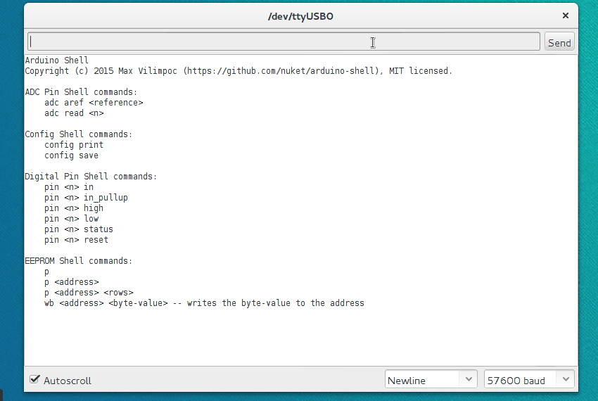

# Arduino Shell

A command shell to interact with built-in Arduino features via the Serial Monitor.

Right now it offers commands:

* to print EEPROM contents in a hexdump-like form
* to write bytes into EEPROM
* to configure the pins for digital I/O mode
* to save the pin configuration to EEPROM
* to print the current pin configuration

Also useful, a super-simple command parser class that breaks a raw input string into 
a command and parameters, which can then be used by other logic to determine the 
next steps.

## Quickstart

1. `cd arduino-1.6.7/hardware/arduino/avr/libraries`
2. `git clone git@github.com:nuket/ArduinoShell.git`
3. Start/restart the Arduino IDE.
4. Run the ArduinoShellBasics example
5. Open the Serial Monitor, set it to 57600 baud, with Newline line endings.
6. Type `pin 13 high` and press Return. The built-in LED on the Arduino should light up.
7. Type `pin 13 low`  and press Return. The built-in LED on the Arduino should turn off.

## Example



## Startup

At startup, the saved pin configuration is reloaded and digital I/O pins are restored
to their last HIGH or LOW voltage level.

## Command Examples

### `help`

Prints out the commands that are available the be played with.

```
Arduino Shell
(c)2015 Max Vilimpoc (https://github.com/nuket/arduino-shell), MIT licensed.

help
ADC Pin Shell commands:
    adc read <n>

Config Shell commands:
    config print
    config save

Digital Pin Shell commands:
    pin <n> in
    pin <n> in_pullup
    pin <n> high
    pin <n> low
    pin <n> status
    pin <n> reset

EEPROM Shell commands:
    p
    p <address>
    p <address> <rows>
    wb <address> <byte-value> -- writes the byte-value to the address
```

### `adc read <n>`

Read analog pin <n> and print the current voltage value.

### `adc aref <reference>`

Set the ADC analog reference voltage source.

### `config print`

Prints the currently running pin configuration, like so:

```
config print
ConfigBlock CRC: 0000b2b1
Config for Pin 00: DIGITAL_INPUT
Config for Pin 01: DIGITAL_OUTPUT_HIGH
Config for Pin 02: DIGITAL_INPUT_PULLUP
Config for Pin 03: DIGITAL_OUTPUT_LOW
[...]
Config for Pin 61: NO_TYPE
Config for Pin 62: NO_TYPE
Config for Pin 63: NO_TYPE
```

The config system does not do any checking whether the pins actually 
exist on your Arduino, so be careful.

### `config save`

Saves the configuration to EEPROM with a CRC checksum of the pin 
configuration.

### `pin <n> in`

Sets the pin to `INPUT` mode and that's all.

### `pin <n> in_pullup`

Sets the pin to `INPUT_PULLUP` mode and that's all.

### `pin <n> high`

Sets the pin to `OUTPUT` mode and sets the voltage level to `HIGH`.

### `pin <n> low`

Sets the pin to `OUTPUT` mode and sets the voltage level to `LOW`.

### `pin <n> status`

Prints the current setting of the pin. Useful for scripting. One of:

```
"NO_TYPE",
"DIGITAL_INPUT",
"DIGITAL_INPUT_PULLUP",
"DIGITAL_OUTPUT_HIGH",
"DIGITAL_OUTPUT_LOW",
"ANALOG_INPUT",
"PWM",
"SERIAL_HARDWARE",
"SERIAL_SOFTWARE",
"SERIAL_CAN",
"SERIAL_I2C",
"SERIAL_SPI"
```

### `pin <n> reset`

Resets the pin to `NO_TYPE` mode, which means that when the Arduino
is reset, there is no configuration performed on this pin.

### `wb address byte`

Write the `byte` to the specified EEPROM `address`.

```
wb 0x51 0x45
command:  >>wb<<
param[0]: >>0x51<<
param[1]: >>0x45<<
0050 | FF 45 FF FF FF FF FF FF FF FF FF FF FF FF FF FF | .E..............      
```

### `p address rows`

Print `rows` rows, starting from EEPROM `address`.

```
p 0x00 10
command:  >>p<<
param[0]: >>0x00<<
param[1]: >>10<<
0000 | FF FF FF FF FF FF FF FF FF FF FF FF FF FF FF FF | ................      
0010 | 42 41 43 FF FF FF FF FF FF FF FF FF FF FF FF FF | BAC.............      
0020 | 47 51 FF FF FF FF FF FF FF FF FF FF FF FF FF FF | GQ..............      
0030 | 57 FF FF FF FF FF FF FF FF FF FF FF FF FF FF FF | W...............      
0040 | FF FF FF FF FF FF FF FF 44 FF FF FF FF FF FF FF | ........D.......      
0050 | FF FF FF FF FF FF FF FF FF FF FF FF FF FF FF FF | ................      
0060 | FF FF FF FF FF FF FF FF FF FF FF FF FF FF FF FF | ................      
0070 | FF FF FF FF FF FF FF FF FF FF FF FF FF FF FF FF | ................      
0080 | FF FF FF FF FF FF FF FF FF FF FF FF FF FF FF FF | ................      
0090 | FF FF FF FF FF FF FF FF FF FF FF FF FF FF FF FF | ................      
```

# Building

Using the latest Arduino 1.6.6 IDE, the project will build with no 
modifications, as all C++ files are now compiled with `-std=gnu++11`.

# License

```
Arduino Shell
Copyright (c) 2015 Max Vilimpoc

Permission is hereby granted, free of charge, to any person obtaining a copy
of this software and associated documentation files (the "Software"), to deal
in the Software without restriction, including without limitation the rights
to use, copy, modify, merge, publish, distribute, sublicense, and/or sell
copies of the Software, and to permit persons to whom the Software is
furnished to do so, subject to the following conditions:

The above copyright notice and this permission notice shall be included in
all copies or substantial portions of the Software.

THE SOFTWARE IS PROVIDED "AS IS", WITHOUT WARRANTY OF ANY KIND, EXPRESS OR
IMPLIED, INCLUDING BUT NOT LIMITED TO THE WARRANTIES OF MERCHANTABILITY,
FITNESS FOR A PARTICULAR PURPOSE AND NONINFRINGEMENT. IN NO EVENT SHALL THE
AUTHORS OR COPYRIGHT HOLDERS BE LIABLE FOR ANY CLAIM, DAMAGES OR OTHER
LIABILITY, WHETHER IN AN ACTION OF CONTRACT, TORT OR OTHERWISE, ARISING FROM,
OUT OF OR IN CONNECTION WITH THE SOFTWARE OR THE USE OR OTHER DEALINGS IN
THE SOFTWARE.
```
